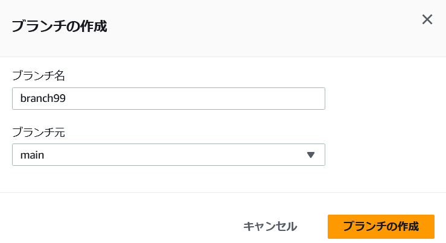
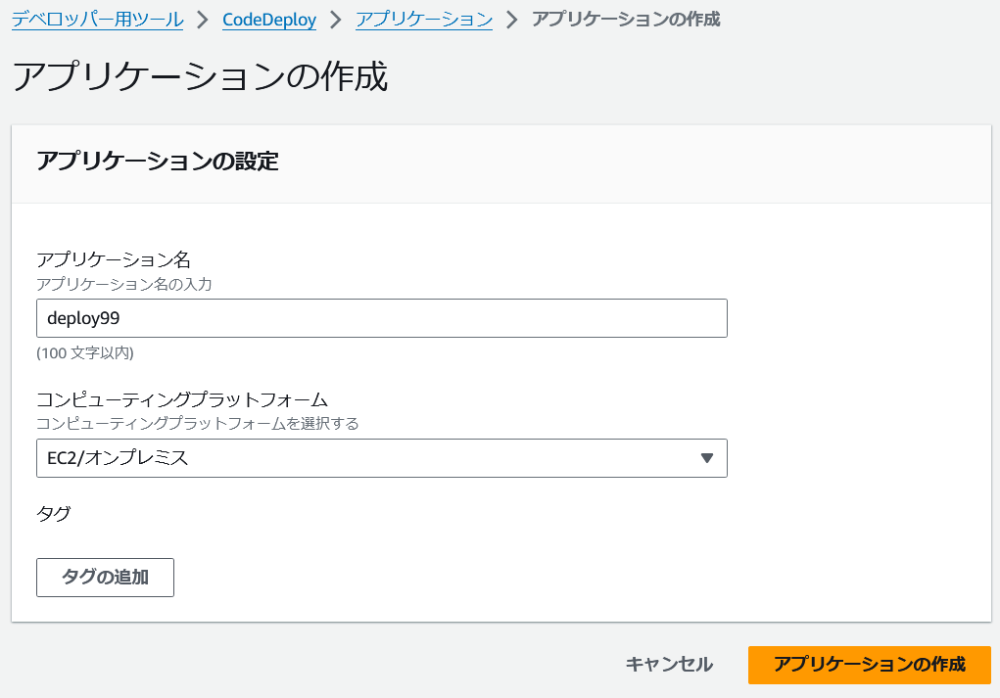
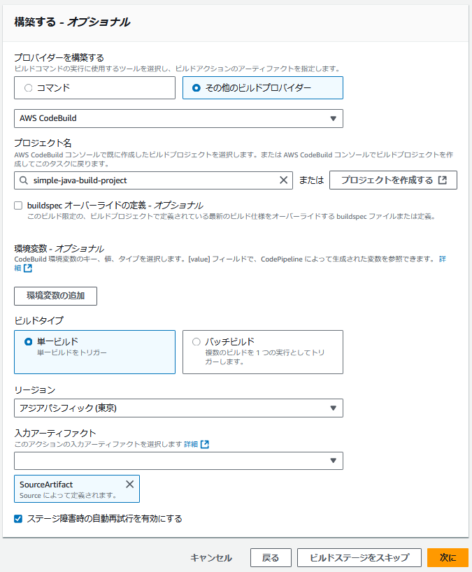
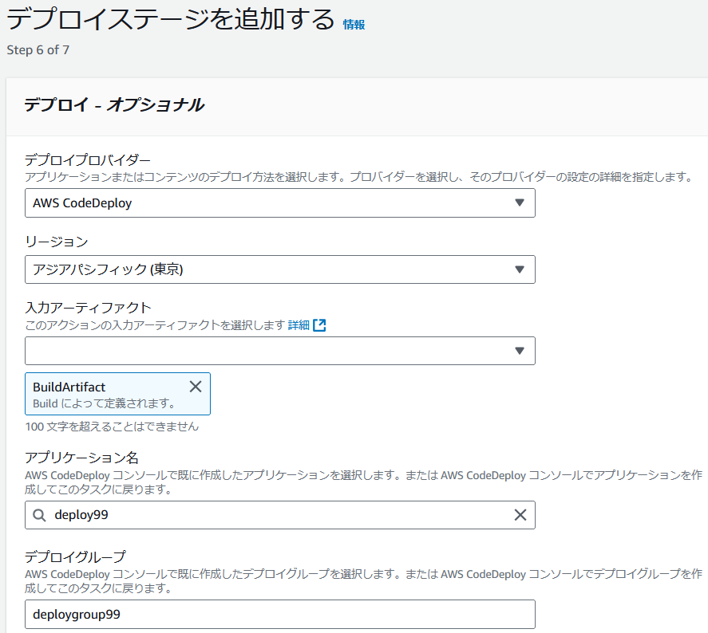
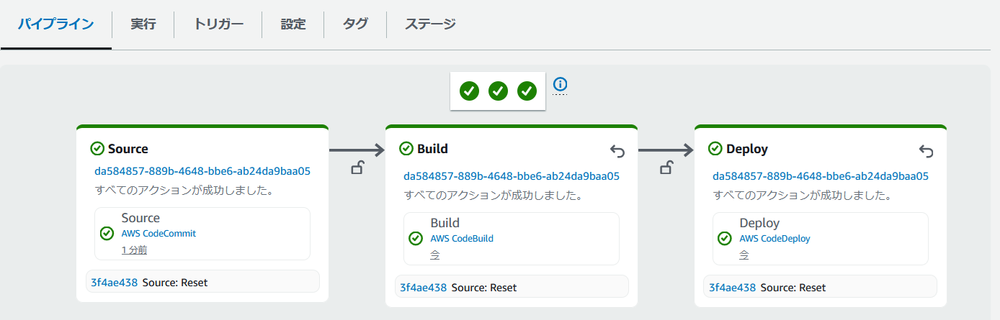

# AWS CodePipeline のワーク

* これは正式なラボとは異なるハンズオンワークです。
* ワークで使用する AWS 環境は、ワーク実施時のみ使用可能です。
* 講師のガイドに基づき、AWS マネジメントコンソールを使用してワーク用の AWS 環境にサインインして下さい。
* **東京リージョン**を使用します。
    - AWS マネジメントコンソールで **東京リージョン** が選択されている状態にしてください。 

---

## ワークの概要

* AWS CodePipeline を使用し、シンプルな Java の Spring Boot アプリケーションのビルドとデプロイを行います。
* Spring Boot アプリケーションは、Hello World! を表示する Web アプリケーションです。
* アプリケーションのソースは、AWS CodeCommit に格納されています。
    - ワーク実施時に自分用のブランチを作成します。
* ビルドは、AWS CodeBuild を使用します。
    - あらかじめ用意されている AWS CodeBuild のビルドプロジェクトを使用します。
* デプロイは AWS CodeDeploy を使用します。
    - ワーク実施時に自分用の AWS CodeDeploy アプリケーションとデプロイグループを作成します。
* パイプラインは、AWS CodePipeline を使用します。
    - ワーク実施時に自分用の AWS CodePipeline のパイプラインを作成します。

---

## AWS CodeCommit のリポジトリでブランチを作成

1. AWS マネジメントコンソールで `CodeCommit` のコンソールを表示します。

1. 左側のナビゲーションメニューから **リポジトリ** をクリックします。

1. リポジトリの一覧から **simple-java** の名前のリンクをクリックします。

1. 左側のナビゲーションメニューから **ブランチ** をクリックします。

1. 右上にある **ブランチの作成** をクリックします。

1. **ブランチの作成** ダイアログで次のように設定します。
    - **ブランチ名** に `branch99`  を入力 **注意：99は、自分の番号に書き換えます。**
    - **ブランチ元** に **main** を選択
    - 設定後、**ブランチの作成** をクリックします。

---

## AWS CodeDeploy のアプリケーションを作成

1. 左側のナビゲーションメニューから **デプロイ・CodeDeploy** を展開表示し、**アプリケーション** をクリックします。

1. **アプリケーションの作成** をクリックします。

1. **アプリケーションの作成** ページで次のように設定します。
    - **アプリケーション名** に `deploy99`  を入力 **注意：99は、自分の番号に書き換えます。**
    - **コンピューティングプラットフォーム** で **EC2/オンプレミス** を選択
    - 設定後、**アプリケーションの作成** をクリックします。

---

## AWS CodeDeploy のデプロイグループを作成

1. **デプロイグループの作成** をクリックします。

1. **デプロイグループ名** に `deploygroup99`  を入力 **注意：99は、自分の番号に書き換えます。**

1. **サービスロールの入力** で **CodeDeployServiceRole** を選択します。

1.　**環境設定** で **Amazon EC2 インスタンス** をチェックして選択します。

1. **キー**に **Name** と入力します。

1. **値** から `simple-java-instance99` を選択します。
    - **注意：99は、自分の番号に置き換えます。**

1. **AWS Systems Manager を使用したエージェント設定** の **AWS CodeDeploy エージェントのインストール** で **なし** を選択します。

1. **Load balancer**　で、**ロードバランシングを有効にする** の **チェックを解除**します。

1. **デプロイグループの作成**　をクリックします。

---

## AWS CodePipeline のパイプラインを作成

1. 左側のナビゲーションメニューから **パイプライン・CodePipeline** を展開表示し、**パイプライン** をクリックします。

1. **パイプラインを作成する** をクリックします。

1. **Category** で **カスタムパイプラインを構築する** を選択して **次に** へをクリックします。

1. **パイプライン名** に `pipeline99`  を入力 **注意：99は、自分の番号に書き換えます。**

1. **サービスロール** で **既存のサービスロール** を選択します。

1. **ロールの ARN** で **CodePipelineRole** を選択します。

1. ページ右下にある **次に** をクリックします。

1. **ソースプロバイダー** で **AWS CodeCommit** を選択します。

1. **リポジトリ名** で `simple-java` を選択します。

1. **ブランチ名** で **自分が作成したブランチの名前** を選択します。(例: branch99)

1. **ソースの変更を自動的に検出する EventBridge ルールを作成** の **チェックを解除** します。
    - 今回使用するハンズオン環境の都合上、EventBridge を用いたソースの変更検知を解除します。

1. ページ右下にある **次に** をクリックします。

1. **プロバイダーを構築する** で **その他のビルドプロバイダー** を選択します。
   
1. ドロップダウンリストから **AWS CodeBuild** を選択します。

1. **プロジェクト名** で `simple-java-build-project` を選択します。

1. ページ右下にある **次に** をクリックします。

1. **テストステージを追加** で **テストステージをスキップ** を選択します。

1. **デプロイプロバイダー** で **AWS CodeDeploy** を選択します。

1. **アプリケーション名** で **自分が作成した CodeDeploy アプリケーションの名前**を選択します。(例: deploy99)

1. **デプロイグループ** で **自分が作成した CodeDeploy デプロイグループの名前**を選択します。(例: deploygroup99)

1. ページ右下にある **次に** をクリックします。

1. ページ右下にある **パイプラインを作成する** をクリックします。

---

## パイプラインの実行完了を待つ

* 下図のようになるまで待機します。（約 2 分ほど）

---

## デプロイされたアプリケーションを確認する

1. AWS マネジメントコンソールで `ec2` のコンソールを表示します。

1. 左側のナビゲーションメニューから **インスタンス** - **インスタンス** をクリックします。

1. インスタンスの一覧から、名前が **simple-java-instance99** の左横のチェックボックスをチェックします。
    **注意：99は、自分の番号に置き換えます。**

1. ページ下部で **詳細** タブが選択されていることを確認し、**パブリック DNS** の値をコピーします。

1. ブラウザで新しいタブを開き、コピーした値を貼り付け、末尾に `:8080` をつけます。
    - 例: `ec2-99-999-999-99.ap-northeast-1.compute.amazonaws.com:8080`
    - (**http://** でアクセスして下さい。) 

1. **Hello World** という文字が表示されることを確認します。

---

## ソースコードリポジトリの変更検知を設定する

1. 今回使用するハンズオン環境の都合上、今回は CodePiplien からのポーリングによる変更検知を設定します。
    - パイプライン作成時に EventBridge による変更検知を有効化している場合は以下の操作は不要ですが、今回は EventBridge を使わないため実施します。

1. AWS マネジメントコンソールの左側のナビゲーションメニューから **パイプライン・CodePipeline** を展開表示し、**パイプライン** をクリックします。

1. 作成したパイプラインの名前のリンクをクリックします。

1. **編集** をクリックします。

1. **編集:Source** のセクションで **ステージを編集する**　をクリックします。

1. Source アクションの鉛筆アイコンをクリックします。

1. **アクションを編集する** の **ブランチ名** で自分が作成したブランチを選択します。

1. **検出オプションを変更する - オプショナル** で **AWS CodePipeline** を選択します。

1. **完了** をクリックします。

1. **編集:Source** のセクションで **完了**　をクリックします。

1. ページ上部の **保存**　をクリックして、確認のダイアログでも **保存** をクリックします。 

---
## ブランチのコードを更新してパイプラインを再実行する

1. 左側のナビゲーションメニューから **ソース・CodeCommit** を展開表示し、 **リポジトリ** をクリックします。

1. リポジトリの一覧から **simple-java** の名前のリンクをクリックします。

1. 左側のナビゲーションメニューから **ブランチ** をクリックします。

1. 自分が作成したブランチ名のリンクをクリックします。

1. **src** のフォルダ名のリンクをクリックし、順にフォルダ名のリンクをクリックします。最終的に下記のファイルを開いた状態にします。
    - **src/main/java/com/example/springboot/HelloApplication.java**

1. **編集** をクリックします。

1. 13行目の `return "Hello World!";` の部分で、`Hello World!` を他のメッセージに変更します。 

1. ページ下部の **作成者名** に 現在使用している IAM ユーザー名、**E メールアドレス** に `dummy@example.com` と入力します。**メッセージのコミット** に `change message` と入力します。
1. ページ右下の **変更のコミット** をクリックします。

1. 左側のナビゲーションメニューから **パイプライン・CodePipeline** を展開表示し、**パイプライン** をクリックします。

1. 自分が作成したパイプライン名のリンクをクリックして、パイプラインが再実行されることを確認します。

1. パイプライン実行の完了後、アプリケーションに再度アクセスして変更が反映されていることを確認します。

*  **以上でワークは終了です。**
    - 時間があれば、AWS CodePipeline や AWS CodeBuild、AWS CodeDeploy のコンソールをみてください。
### ワークを終了する時は、AWS マネジメントコンソールからサインアウトして下さい。

### お疲れ様でした！
